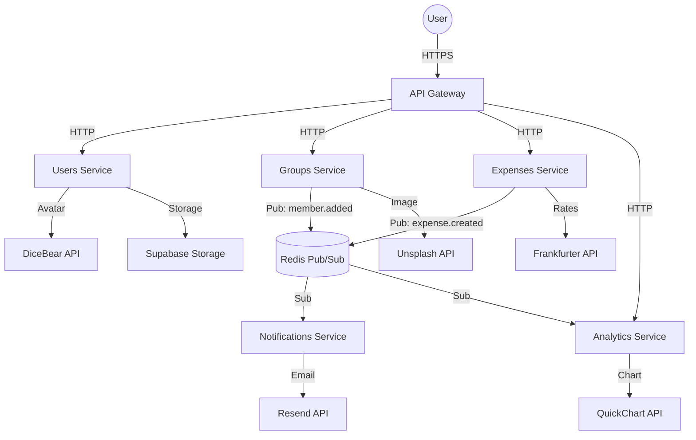

  <h1 align="center">
   
  0debt
</h1>

<h4 align="center">A cloud-native microservices platform to simplify shared expense management and split bills effortlessly.</h4>

  

    
    
    
    
  

**0debt** is a scalable, distributed financial application built on modern cloud-native principles. It solves the complexity of "who owes who" in group activities through a resilient microservices architecture, real-time event processing, and a clean user experience.

## Microservices ecosystem

The 0debt platform consists of loosely coupled services communicating via HTTP and Redis Pub/Sub:

### Core services

| Service | Description | Repository |
|---------|-------------|------------|
| **users-service** | Source of truth for identity. Handles authentication (JWT), secure password hashing, and subscription plans | [0debt/users-service](https://github.com/0debt/users-service) |
| **groups-service** | Manages collaboration spaces, membership logic, and synchronization with user profiles | [0debt/groups-service](https://github.com/0debt/groups-service) |
| **expenses-service** | Financial engine. Records transactions and executes the debt simplification algorithm. Orchestrates distributed transactions (Saga pattern) | [0debt/expenses-service](https://github.com/0debt/expenses-service) |

### Business & support services

| Service | Description | Repository |
|---------|-------------|------------|
| **analytics-service** | Provides financial health insights and budget tracking. Generates visual reports via QuickChart | [0debt/analytics-service](https://github.com/0debt/analytics-service) |
| **notifications-service** | Event-driven service that handles transactional emails via Resend and background jobs | [0debt/notifications-service](https://github.com/0debt/notifications-service) |

### Infrastructure

| Component | Description | Repository |
|-----------|-------------|------------|
| **api-gateway** | Edge entry point. Reverse proxy built with Hono handling routing, rate limiting, and security validation | [0debt/api-gateway](https://github.com/0debt/api-gateway) |
| **0debt-frontend** | Modern SPA built with Next.js, Shadcn UI, and TailwindCSS, optimized for Bun runtime | [0debt/frontend](https://github.com/0debt/frontend) |
| **0debt-infra** | Infrastructure configuration and documentation | [0debt/0debt-infra](https://github.com/0debt/0debt-infra) |

## Architecture

## Communication patterns

### Synchronous (HTTP)

- **North-South:** Client → API Gateway → Microservices
- **East-West:** Internal service-to-service calls for validation and data retrieval

### Asynchronous (Redis Pub/Sub)

Event-driven architecture for non-blocking communication:

| Publisher | Event | Subscribers |
|-----------|-------|-------------|
| expenses-service | `expense.created` | notifications-service, analytics-service |
| groups-service | `member.added`, `member.removed`, `group.deleted` | notifications-service |

## Distributed transactions (Saga pattern)

The platform implements an **orchestrated Saga** for critical operations like user deletion:

1. **Validation:** expenses-service checks for pending debts
2. **Execution:** users-service deletes user record
3. **Cleanup:** analytics-service removes associated budgets

This ensures data consistency across services while maintaining financial integrity.

## External APIs

| API | Function | Consumer |
|-----|----------|----------|
| **QuickChart** | Chart generation (PNG) | analytics-service |
| **Resend** | Transactional emails | notifications-service |
| **Frankfurter** | Currency exchange rates | expenses-service |
| **Unsplash** | Group images | groups-service |
| **DiceBear** | Avatar generation | users-service |
| **Supabase Storage** | File storage | users-service |

## Documentation

For detailed architectural decisions and specifications:

| Document | Description |
|----------|-------------|
| [Architecture diagram](https://github.com/0debt/0debt-infra/blob/main/docs/diagrams/architecture.md) | Complete system architecture with Mermaid |
| [Saga pattern](https://github.com/0debt/0debt-infra/blob/main/docs/SAGA_PATTERN.md) | Distributed transaction implementation |
| [Redis Pub/Sub](https://github.com/0debt/0debt-infra/blob/main/docs/comunicacion_asincrona_redis.md) | Asynchronous communication details |
| [External APIs](https://github.com/0debt/0debt-infra/blob/main/docs/agreements/external-apis.md) | Third-party API integration specs |
| [Customer agreement](https://github.com/0debt/0debt-infra/blob/main/docs/agreements/customer-agreement.md) | Terms of service |
| [Pricing plans](https://github.com/0debt/0debt-infra/blob/main/docs/agreements/pricing.md) | FREE, PRO, ENTERPRISE tiers |
| [SLA](https://github.com/0debt/0debt-infra/blob/main/docs/agreements/sla.md) | Service level agreement |
| [Privacy policy](https://github.com/0debt/0debt-infra/blob/main/docs/agreements/privacy-policy.md) | Data protection and GDPR compliance |

## Tech stack

| Layer | Technology |
|-------|------------|
| Runtime | Bun |
| Backend framework | Hono |
| Frontend | Next.js 16, Shadcn UI, TailwindCSS |
| Database | MongoDB Atlas |
| Cache & messaging | Redis |
| Infrastructure | Hetzner VPS + Coolify |
| CI/CD | GitHub Actions |

## License

Apache License 2.0
